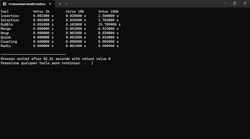

# 🧮 Algoritmos de Ordenação em C: Análise de Desempenho e Complexidade


## 📖 Sobre o Projeto

Este repositório é um laboratório prático e completo de **Algoritmos de Ordenação** desenvolvidos em linguagem **C**. 

Muito além de apenas implementar o código, este projeto foi criado para analisar empiricamente a teoria da Ciência da Computação. O estudo foca em:
* **Análise de Complexidade de Tempo (Big O):** Comprovar na prática a diferença entre algoritmos **O(n²)**, **O(n log n)** e **O(n)**.
* **Gerenciamento de Memória:** O uso de alocação dinâmica (`malloc`/Heap) para lidar com grandes volumes de dados sem causar *Stack Overflow*.
* **Estabilidade:** Entender como os algoritmos se comportam com valores duplicados.
* **Benchmark Real:** Testes de estresse com vetores aleatórios de 1.000, 10.000 e 100.000 elementos.

O código foi estruturado de forma modular, separando a interface (`.h`), a implementação (`.c`) e o programa de teste (`main.c`), seguindo as boas práticas de engenharia de software.

---

## 🏆 Resultados do Benchmark (O Melhor e o Pior)

Para provar a teoria na prática, os algoritmos foram submetidos a um teste de estresse ordenando vetores de **100.000 números inteiros aleatórios**. Abaixo estão os destaques do desempenho:

* 🥇 **Melhor Absoluto (Não-comparativo):** `Counting Sort` **(0.003s)**. Por não usar comparações (`if a > b`) e focar em contagem de índices, ele varre o vetor de forma quase instantânea (Tempo Linear).
* 🥇 **Melhor Comparativo:** `Quick Sort` **(0.016s)**. Dividindo para conquistar, ele confirma por que é o padrão da indústria. Excelente uso do cache de memória do processador.
* 🐢 **O Mais Lento:** `Bubble Sort` **(35.709s)**. O excesso de trocas (*swaps*) na memória e a complexidade quadrática fazem dele o pior cenário possível para grandes volumes de dados.

### 📸 Prova Visual
<div align="center">
  
</div>

### 🖥️ Ambiente de Testes (Setup)
Como os tempos absolutos variam conforme o hardware, os testes acima servem como comparativo de proporção e foram executados na seguinte configuração:
* **Processador:** Intel Core i5 13ª Gen
* **Memória RAM:** 8GB DDR5
* **Sistema Operacional:** Windows 11
* **Compilador:** IDE (DevC++)

---

## 📊 Comparativo e Casos de Uso (Quando usar qual?)

| Algoritmo | Complexidade (Média) | Memória | Estabilidade | Quando Utilizar no Mundo Real? |
| :--- | :---: | :---: | :---: | :--- |
| **Bubble Sort** | O(n²) | O(1) | ✅ Estável | **Nunca em produção.** Apenas para fins didáticos e introdução à lógica de programação. |
| **Selection Sort**| O(n²) | O(1) | ❌ Instável | Quando a memória é extremamente limitada e o custo de escrita na memória é muito alto (ele faz no máximo *n* trocas). |
| **Insertion Sort**| O(n²) | O(1) | ✅ Estável | Quando o array é pequeno ou quando os dados já estão **quase ordenados**. |
| **Merge Sort** | O(n log n) | O(n) | ✅ Estável | Quando a **estabilidade é obrigatória** em grandes volumes de dados ou ao ordenar dados que não cabem na RAM (ordenação externa). |
| **Heap Sort** | O(n log n) | O(1) | ❌ Instável | Sistemas embarcados ou cenários com memória estrita, pois garante velocidade O(n log n) sem usar memória extra. |
| **Quick Sort** | O(n log n) | O(log n)| ❌ Instável | **Padrão da Indústria.** O melhor algoritmo de uso geral para dados armazenados na memória RAM, devido à sua localidade de cache. |
| **Counting Sort** | O(n+k) | O(k) | ✅ Estável | Quando você tem inteiros dentro de um intervalo (*range*) pequeno e conhecido. |
| **Radix Sort** | O(nk) | O(n+k) | ✅ Estável | Quando é necessário ordenar números inteiros muito grandes ou strings (lexicograficamente). |

---

## 🧠 Lições Aprendidas no Estudo

Além da lógica de ordenação, este projeto lidou com desafios reais do ecossistema da linguagem C:

1. **Stack Overflow vs Heap:** Vetores de 100.000 posições alocados diretamente na função `main()` estouram o limite de memória da Pilha (Stack) do sistema operacional, causando fechamento silencioso (Crash). A solução aplicada foi migrar a estrutura para a memória **Heap** utilizando ponteiros e `malloc()`.
2. **Segmentation Fault:** Em algoritmos recursivos como *Merge Sort* e *Quick Sort*, passar o tamanho exato do array como limite (`100000`) em vez do último índice válido (`99999`) leva a acessos ilegais de memória. O controle rigoroso de índices foi essencial.
3. **Localidade de Referência:** Observou-se na prática que o Quick Sort é mais rápido que o Merge Sort e Heap Sort na maioria das vezes, não pela matemática do Big-O (todos são *n log n*), mas pela forma sequencial como ele acessa a memória RAM, aproveitando o Cache L1/L2 do processador.

---

## ⚖️ O que é Estabilidade?

Um algoritmo de ordenação é considerado **estável** quando ele preserva a ordem relativa original de elementos que possuem valores ou chaves iguais.

**Exemplo:**
Imagine que você tem uma lista de alunos ordenada alfabeticamente e quer reordená-la por nota.
* **Estável:** Se dois alunos tiverem a mesma nota, o algoritmo manterá a ordem alfabética (ordem original) entre eles.
* **Instável:** A ordem entre os alunos com a mesma nota pode ser bagunçada.

---

## 📂 Estrutura do Repositório

* `sort.h`: Cabeçalho com as assinaturas das funções.
* `sort.c`: Implementação detalhada e comentada de todos os algoritmos.
* `main.c`: Script principal com alocação dinâmica, geração de dados aleatórios, controle de tempo e formatação dos resultados no console.
* `TabelaTempoOrdenacao.dev`: Arquivo de projeto para IDE Dev-C++.

---

## 💻 Como Compilar e Rodar

### Pré-requisitos
Você precisará de um compilador C, como o **GCC** ou utlizar uma IDE.

### ⌨️ Opção 1: Via Terminal

1. **Clone o repositório:**
   ```bash
   git clone https://github.com/MarcosViniciusBrandao/Tabela-Tempo-Ordenação.git
   cd Tabela-Tempo-Ordenação
2. **Compile os arquivos:**
   ```bash
   gcc main.c sort.c -o sortapp
3. **Execute o programa:**
   ```bash
	 ./sortapp 	-> Linux ou Mac 
	 sortapp.exe 	-> Windows
### 🛠️ Opção 2: Utilizando IDEs (DevC++)
O projeto já inclui o arquivo de configuração `.dev`.
1. Dê um duplo clique no arquivo **`TabelaTempoOrdenacao.dev`**.  
2. Com o projeto aberto, pressione **F11** (ou vá no menu _Execute > Compile & Run_).
## 🤝 Contribuição

[](https://github.com/MarcosViniciusBrandao/Tabela-Tempo-Ordenação#-contribui%C3%A7%C3%A3o)

Contribuições são bem-vindas! Se você tiver sugestões de otimização ou novos algoritmos, sinta-se à vontade para abrir um **Issue** ou enviar um **Pull Request** .

1.  Faça um Fork do projeto
2.  Crie um Branch para seu Feature ( `git checkout -b feature/NovoAlgoritmo`)
3.  Faça o Commit ( `git commit -m 'Adicionado Shell Sort'`)
4.  Faça o Push ( `git push origin feature/NovoAlgoritmo`)
5.  Abra um Pull Request

----------

## 📝 Licença

[](https://github.com/MarcosViniciusBrandao/Tabela-Tempo-Ordenação#-licen%C3%A7a)

Este projeto está sob licença MIT. 
Veja o arquivo [LICENSE](https://github.com/MarcosViniciusBrandao/Tabela-Tempo-Ordenação/blob/main/LICENSE) para mais detalhes.

----------

<p align="center">
  Feito com 💙 por <a href="https://marcosviniciusbrandao.com.br">Marcos Vinicius</a>
</p>